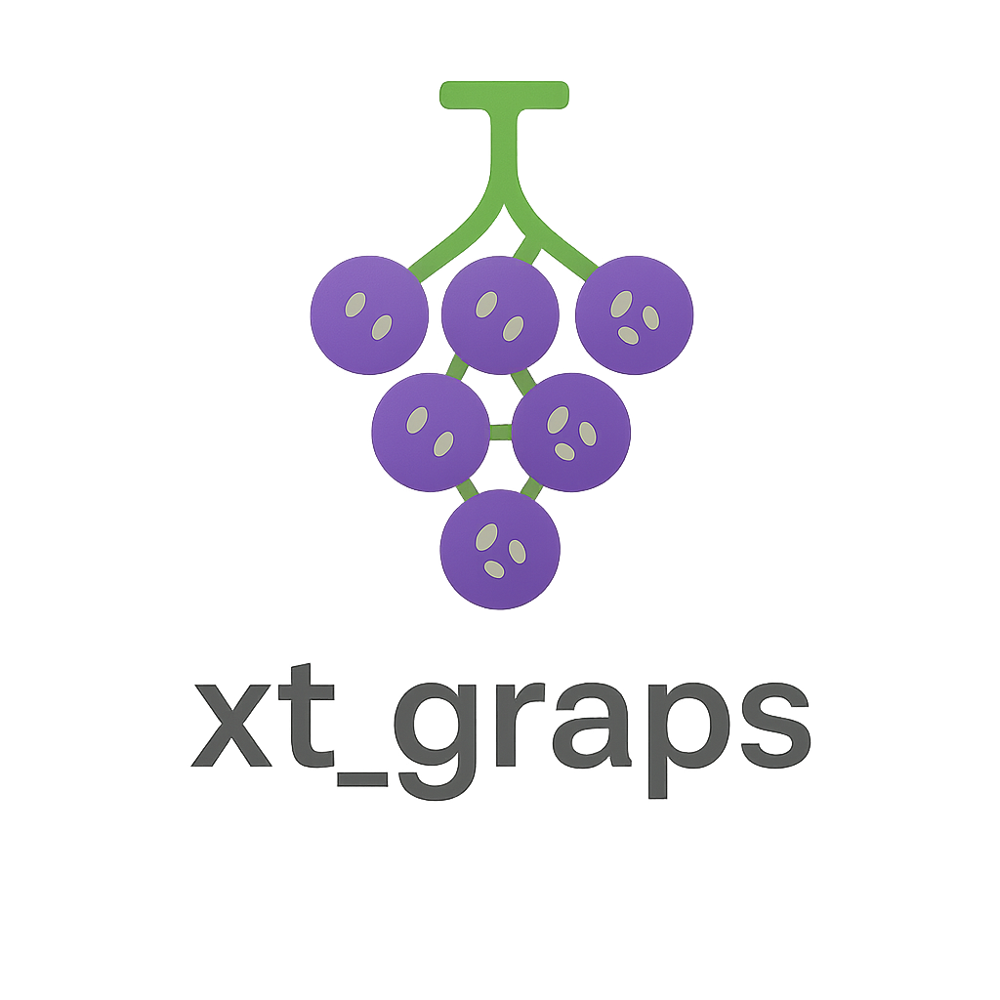

# xt_graps

#### 介绍
**xt_graps** 是一个使用 C 语言实现的高性能动态进程池与线程池管理框架，专为支持在高并发生产环境下实现资源弹性调度而设计。

#### 软件架构
采用“葡萄藤”式结构设计：主进程是藤蔓（串），子进程如分支，线程如葡萄粒，实现动态创建与伸缩管理，灵活扩展、协同工作。

## 核心特性

- 🚀 **动态可伸缩性**：根据配置和实时负载，动态调整进程与线程数量。
- ⚙️ **统一资源管理**：线程与进程资源统一管理，支持跨模块任务调度。
- 🧠 **智能调度策略**：支持定制的策略算法（如并发数检测、自适应负载均衡）动态优化资源分配。
- 🍇 **池化结构类比**：采用“葡萄串”式结构，主进程为串，子进程为葡萄，每个子进程内部创建多个线程，高效协作。
- 🧩 **模块化设计**：便于嵌入现有 C 应用中，支持按需裁剪、重构与集成。
- 🛡️ **稳定可靠**：为生产环境设计，具备崩溃隔离、资源回收等健壮性机制。

## 适用场景

- 高并发的 C 网关服务程序
- 后台批处理服务（进程任务调度）
- 容器内轻量服务协同框架
- 内存受限设备上的多任务执行引擎

## 联系与贡献

欢迎任何感兴趣的开发者参与改进与测试本项目，也欢迎提出建议：

📧 **作者邮箱**: `whoxitengwho@outlook.com`  
📌 如果你有建议或想法，欢迎提交 [Issue] 或 Pull Request！

---
本项目为开源项目，遵循 Apache 2.0 协议，欢迎自由使用和修改。
